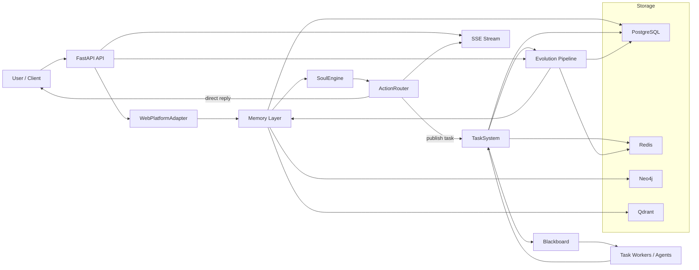

# Mirror

Mirror 是一个面向长期陪伴场景的本地优先 AI Agent 运行时。它把同步对话、异步任务执行、长期记忆和受控进化放在同一套系统里，目标不是只“回答一次”，而是在多轮关系中保持上下文、积累记忆，并逐步形成稳定的陪伴行为。

当前实现基于 `FastAPI + asyncio`，通过 `PostgreSQL / Redis / Neo4j / Qdrant` 组合完成状态持久化、事件分发、关系图谱和语义检索。

## 系统目标

- 提供可直接接入的对话 API 与流式输出能力
- 支持任务发布、异步执行和 HITL（Human-in-the-loop）反馈闭环
- 支持用户长期记忆、关系状态和记忆治理
- 支持对话结束后的后台观察、反思、认知更新与温和主动性
- 保持单机优先、可降级运行、便于后续扩展 Skill / Tool / MCP / Agent

## 技术栈

- Python 3.11+
- FastAPI / Uvicorn
- PostgreSQL
- Redis
- Neo4j
- Qdrant
- Pydantic Settings
- Structlog
- Pytest / pytest-asyncio

## 仓库结构

```text
app/
  api/          HTTP API 层
  agents/       内建 agent 定义
  evolution/    观察、反思、记忆更新、关系演化、主动性
  hooks/        Hook 注册与扩展点
  infra/        基础设施适配，例如 outbox store
  memory/       Core memory、图谱、向量检索、会话上下文、治理
  platform/     平台适配层，当前主要是 Web 平台
  providers/    模型 provider 与路由抽象
  runtime/      启动编排、依赖装配、生命周期管理
  skills/       Skill loader 与技能扩展
  soul/         核心推理与动作决策
  stability/    幂等、熔断、快照等稳定性组件
  tasks/        Task system、blackboard、worker、relay
  tools/        工具注册、builtin tool、MCP adapter
docker/         辅助镜像与本地依赖
migrations/     PostgreSQL 初始化脚本
docs/           阶段文档与设计说明
tests/          单元测试、集成测试、评估测试
start.ps1       Windows 启动脚本
start.sh        Unix 启动脚本
docker-compose.yml
```

## 系统架构

系统可以理解为三层：

1. 同步对话层：接收用户输入，加载短期/长期上下文，做一次快速推理并返回动作结果。
2. 任务执行层：把需要异步处理的动作发布为任务，由 worker 和 blackboard 协作执行。
3. 后台进化层：在对话结束或任务完成后异步触发观察、反思、关系更新、记忆治理和主动性逻辑。



## 核心模块说明

### 1. API 层

入口在 [app/main.py](C:/Users/IVES/Documents/Code/Projects/Mirror/app/main.py)。

- `POST /chat`：同步对话入口
- `GET /chat/stream`：基于 SSE 的会话流式输出
- `POST /hitl/respond`：人工审批/拒绝/延后任务
- `GET /evolution/journal`：查看最近进化日志
- `GET /memory`：查看用户记忆
- `GET /memory/governance`：查看记忆治理策略
- `POST /memory/governance/block`：阻止某类内容继续学习
- `POST /memory/correct`：修正记忆
- `POST /memory/delete`：删除记忆

### 2. Runtime 装配层

入口在 [app/runtime/bootstrap.py](C:/Users/IVES/Documents/Code/Projects/Mirror/app/runtime/bootstrap.py)。

这里负责：

- 初始化外部依赖连接
- 注册内建 agent、tool、hook、skill、MCP
- 装配 `SoulEngine`、`ActionRouter`、`TaskSystem`
- 启动 `OutboxRelay`、`TaskMonitor`、`TaskWorkerManager`、`EvolutionScheduler`
- 暴露统一的健康状态快照

这也是整个系统最重要的“接线板”。新增组件时，优先沿这里的装配模式扩展，而不是在业务代码里直接拼装依赖。

### 3. Soul 层

位于 `app/soul/`。

- `SoulEngine`：负责读取输入、结合记忆和上下文做动作决策
- `ActionRouter`：把动作转成用户可见回复、任务发布、HITL 等执行结果

可以把它理解为“前台实时决策核心”。

### 4. Memory 层

位于 `app/memory/`。

- `CoreMemoryStore` / `CoreMemoryCache`：核心记忆存储与缓存
- `SessionContextStore`：会话内上下文
- `GraphStore`：长期稳定关系写入 Neo4j
- `VectorRetriever`：从 Qdrant 做语义检索
- `MemoryGovernanceService`：提供用户可控的记忆治理能力

设计上强调：

- PostgreSQL 负责真相源和结构化状态
- Neo4j 负责长期关系图谱
- Qdrant 负责语义检索
- Redis 负责热路径辅助、事件和流式协作，而不是最终真相源

### 5. Task 层

位于 `app/tasks/`。

- `TaskStore`：任务状态持久化
- `TaskSystem`：任务发布与协调
- `Blackboard`：任务协同、恢复、HITL 反馈接入
- `TaskWorker` / `TaskWorkerManager`：执行 agent
- `OutboxRelay`：通过 outbox 模式把状态变化可靠投递到事件通道
- `TaskMonitor`：运行观测

这层把“同步返回”和“慢操作执行”拆开，避免对话路径被阻塞。

### 6. Evolution 层

位于 `app/evolution/`。

主要包括：

- `ObserverEngine`
- `MetaCognitionReflector`
- `CognitionUpdater`
- `PersonalityEvolver`
- `RelationshipStateMachine`
- `CoreMemoryScheduler`
- `EvolutionJournal`
- `GentleProactivityService`

这部分是 Mirror 与普通问答服务差异最大的地方。系统不会把所有变化都立即写死在主流程，而是在异步链路里逐步完成“观察 -> 反思 -> 候选更新 -> 写入记忆/关系 -> 后续生效”。

## 运行依赖

本项目默认依赖以下本地服务：

- PostgreSQL
- Redis
- Neo4j
- Qdrant
- OpenCode stub / `opencode` 服务

这些依赖已在 [docker-compose.yml](C:/Users/IVES/Documents/Code/Projects/Mirror/docker-compose.yml) 中提供。

## 快速开始

### 方式一：使用启动脚本

Windows:

```powershell
python -m venv .venv
.venv\Scripts\Activate.ps1
pip install -r requirements.txt
Copy-Item .env.example .env
./start.ps1
```

Linux / macOS:

```bash
python -m venv .venv
source .venv/bin/activate
pip install -r requirements.txt
cp .env.example .env
./start.sh
```

`start.ps1` 会做这些事：

- 加载 `.env`
- 检查 `docker`、`python`、`uvicorn`
- 启动 `docker compose` 中的基础设施
- 如果本机安装了 `opencode` 命令，则尝试拉起本地 `opencode serve`
- 启动 `uvicorn app.main:app`

### 方式二：手动启动

1. 安装 Python 依赖

```powershell
pip install -r requirements.txt
```

2. 准备环境变量

```powershell
Copy-Item .env.example .env
```

3. 启动基础设施

```powershell
docker compose up -d
```

4. 启动应用

```powershell
uvicorn app.main:app --host 0.0.0.0 --port 8000
```

5. 健康检查

打开 [http://127.0.0.1:8000/health](http://127.0.0.1:8000/health)

## 配置说明

配置集中在 [app/config.py](C:/Users/IVES/Documents/Code/Projects/Mirror/app/config.py)，并通过 `.env` 注入。

常用配置包括：

- 应用：`APP_NAME`、`APP_ENV`、`APP_PORT`
- PostgreSQL：`POSTGRES_*`
- Redis：`REDIS_*`
- Neo4j：`NEO4J_*`
- Qdrant：`QDRANT_*`
- OpenCode：`OPENCODE_*`
- 模型路由：
  - `MODEL_REASONING_MAIN_*`
  - `MODEL_LITE_EXTRACTION_*`
  - `MODEL_RETRIEVAL_EMBEDDING_*`
  - `MODEL_RETRIEVAL_RERANKER_*`
- 扩展加载：`SKILLS_DIR`、`MCP_SERVERS_FILE`、`MCP_SERVERS_JSON`

`.env.example` 已给出一套本地开发默认值。实际接入模型时，至少需要补充对应 provider 的 `API_KEY` 和 `BASE_URL`。

## 降级运行

Mirror 的设计不是“依赖少一个就完全起不来”，而是尽量在本地保持可用：

- PostgreSQL 不可用：任务存储进入 degraded 状态
- Redis 不可用：流式输出、事件总线、会话上下文等能力降级
- Neo4j 不可用：关系图谱写入降级
- Qdrant 不可用：向量检索降级

健康状态可通过 `/health` 查看，`app/runtime/bootstrap.py` 会汇总各子系统状态和降级原因。

## 典型请求链路

### 对话链路

1. 客户端调用 `POST /chat`
2. `WebPlatformAdapter` 统一规范化输入
3. `CoreMemoryCache` 和 `SessionContextStore` 读取上下文
4. `SoulEngine` 生成动作
5. `ActionRouter` 决定直接回复、发布任务或进入 HITL
6. 如果启用流式，客户端通过 `GET /chat/stream` 订阅会话事件

### 异步任务链路

1. `ActionRouter` 发布任务
2. `TaskSystem` 写入任务与 outbox
3. `OutboxRelay` 投递到事件通道
4. `Blackboard` 与 `TaskWorkerManager` 协调 agent 执行
5. 任务完成、失败或等待 HITL 时回写状态

### 进化链路

1. 对话结束或任务完成后发出事件
2. `ObserverEngine` 和 `MetaCognitionReflector` 消费事件
3. `CognitionUpdater` / `PersonalityEvolver` / `RelationshipStateMachine` 生成更新
4. `CoreMemoryScheduler`、图谱、日志等组件持久化结果
5. 后续对话再自然使用这些更新

## 测试

项目使用 `pytest`，覆盖 API、runtime、memory、task、soul、evolution 和 companion eval 场景。

运行全部测试：

```powershell
pytest
```

运行某一类测试：

```powershell
pytest tests/test_runtime_bootstrap.py
pytest tests/test_soul_engine.py
pytest tests/test_companion_evals.py -m eval
```

`pytest.ini` 中定义了 `eval` marker，用于长链路陪伴评估场景。

## 开发建议

- 新能力优先接到 `app/runtime/bootstrap.py` 统一装配
- 不要在业务代码里直接硬编码模型 SDK；通过 provider registry 注入
- 平台相关能力通过 platform adapter 接入
- 扩展优先走 registry / loader 模式，而不是直接互相 import
- 需要用户可控、可回滚的行为，优先放入 memory governance / evolution pipeline，而不是塞进同步回复主链路

## 相关文档

- [main_agent_architecture_v3.4.md](C:/Users/IVES/Documents/Code/Projects/Mirror/main_agent_architecture_v3.4.md)
- [PLAN.md](C:/Users/IVES/Documents/Code/Projects/Mirror/PLAN.md)
- [LONG_TERM_COMPANION_PLAN.md](C:/Users/IVES/Documents/Code/Projects/Mirror/LONG_TERM_COMPANION_PLAN.md)
- [OPTIMIZATION_PLAN.md](C:/Users/IVES/Documents/Code/Projects/Mirror/OPTIMIZATION_PLAN.md)

如果你是第一次接手这个仓库，推荐阅读顺序：

1. `README.md`
2. `app/runtime/bootstrap.py`
3. `app/main.py`
4. `app/soul/*`、`app/memory/*`、`app/tasks/*`
5. `main_agent_architecture_v3.4.md`
